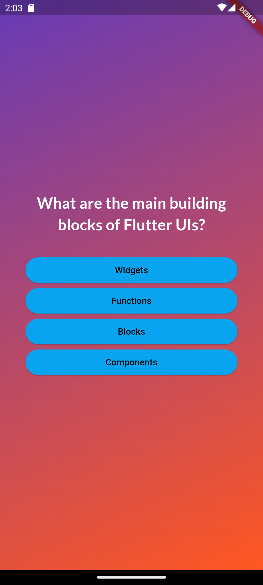
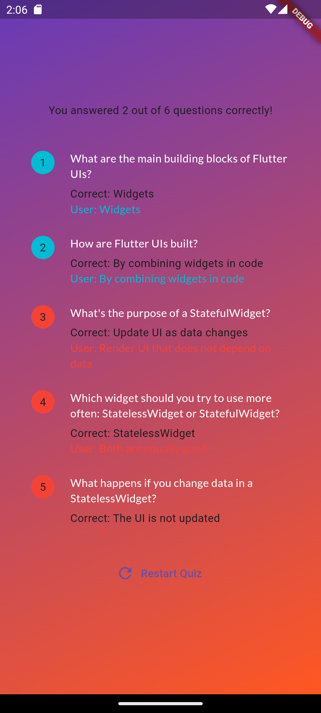

# flutter_quiz

A practice project in Flutter that implements a UI with a Quiz. The Quiz asks several questions with 4 possible answers (only 1 correct though) for each question. At the end, shows a summary of the correct and wrong answers.

## Screenshots

  
  

